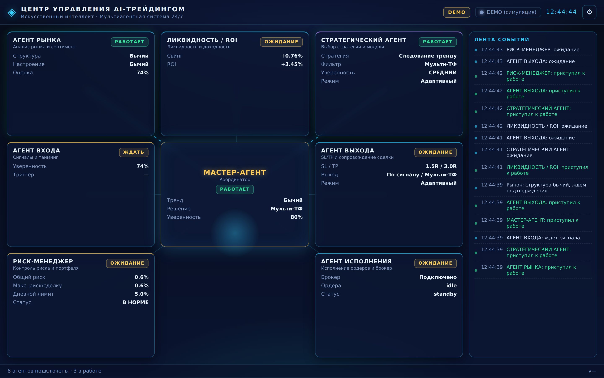
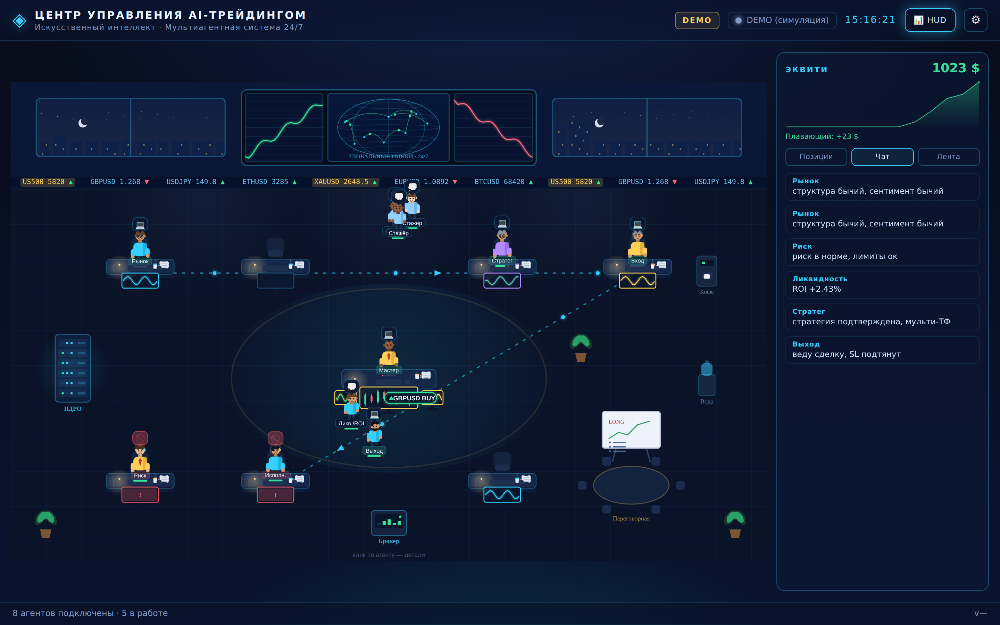
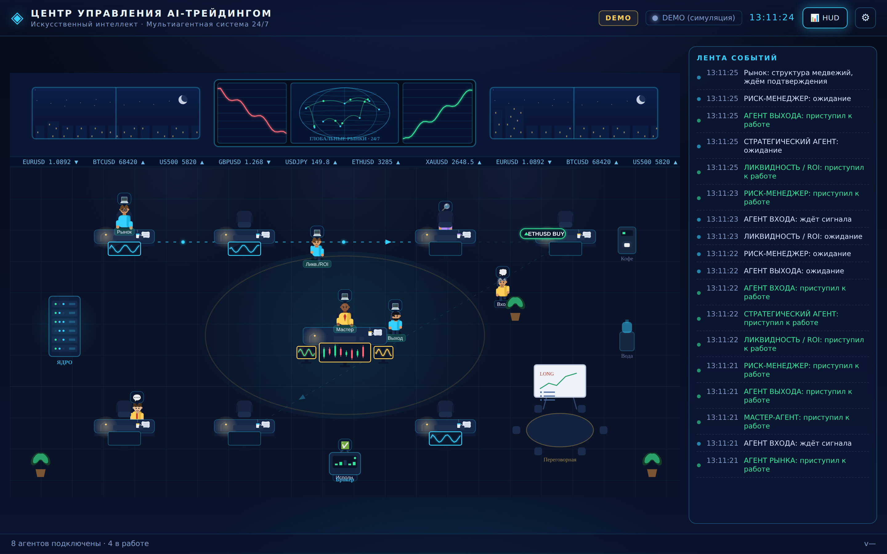
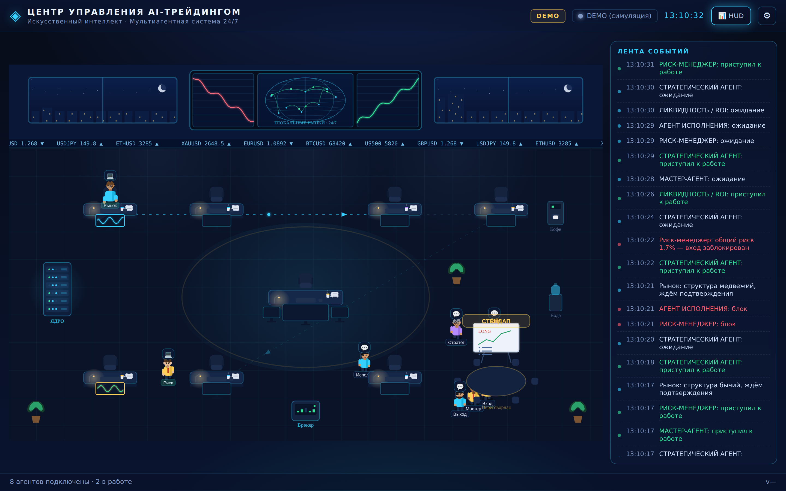

# AI Trading Office

Десктоп-программа (Windows / macOS / Linux) — **живой командный центр** для
мультиагентной торговой системы из 8 агентов. Запустил → сразу видишь, что
агенты делают прямо сейчас: статусы (РАБОТАЕТ / ОЖИДАНИЕ / БЛОК), живые метрики
(уверенность, тренд, риск, ROI, SL/TP), центральный хаб с линиями связи и лента
событий.

Собрано по навыку **`agent-office`** (режим *observability*, доставка *Electron
desktop*).

## Два вида (переключатель 🏢 Зал ⇄ 📊 HUD вверху справа)

Один и тот же живой стейт можно смотреть в двух стилях:

- **HUD / командный центр** — панель на каждого агента с живыми метриками и
  статусами, центральный хаб и линии связи. Плотные цифры с одного взгляда.
- **Зал (пиксельный офис)** — агенты как человечки (лица, причёски, руки на
  клавиатуре): сидят и печатают за рабочими станциями, когда РАБОТАЮТ; встают и
  идут к кофе/воде, к стойке «ЯДРО» или бродят по залу, когда в ОЖИДАНИИ;
  подсвечиваются красным при БЛОКЕ. Над головой — эмодзи действия (💻 ☕ 💧 🔎 🔧 🚫).
  Офис обставлен: видеостена котировок и окна с ночным городом на задней стене,
  стойка-ядро с лампочками, переговорный стол, кофемашина, кулер, растения,
  мониторы с живыми графиками.
  - **Стрелки-сигналы** показывают торговый пайплайн **Рынок → Стратег → Вход →
    Исполнение**: по линиям бегут импульсы, сегмент разгорается, когда его агент
    работает.
  - **Бегущий сигнал сделки** — когда пайплайн «горячий», по стрелкам едет
    плашка с символом и стороной (напр. «▲ XAUUSD BUY» / «▼ EURUSD SELL»), цвет
    по стороне.
  - **Забег к брокеру** — на сделке Агент исполнения встаёт, несёт ордер 📦 к
    терминалу «Брокер», доставляет ✅ и возвращается за стол.
  - **Стендап** — периодически свободные (не занятые) агенты собираются у
    переговорного стола под баннером «СТЕНДАП» (у маркерной доски), затем
    расходятся.
  - **Детали окружения**: на задней стене — видеостена (график роста · мировая
    карта со связями · график падения), окна с луной/звёздами/городом и бегущая
    строка котировок; у агентов очки/гарнитуры/галстуки по ролям, лица с мимикой
    по статусу; на столах лампы с тёплым светом, бумаги и кружки; свечные
    графики на мониторах.






## Два режима данных

- **DEMO** (по умолчанию) — встроенный симулятор оживляет офис: метрики
  двигаются, статусы меняются, идёт лента событий. Работает сразу, без бэкенда.
  В шапке горит жёлтый бейдж **DEMO** — цифры ненастоящие.
- **LIVE** — подключение к вашему «ядру» по WebSocket. Как только снимок
  состояния приходит, шапка переключается на зелёный **LIVE**, и панели
  показывают **реальные** данные. Правило честности: в LIVE показывается только
  то, что реально прислал бэкенд.

Переключение автоматическое: приложение стартует в DEMO и само переходит в LIVE,
когда ядро отвечает.

## Быстрый старт (разработка)

```bash
cd AI-Trading-Office-V4
npm install
npm start          # откроется окно Electron (DEMO сразу живой)
```

Хотите просто взглянуть без Electron? Откройте `renderer/index.html` в браузере —
увидите офис в DEMO-режиме (без подключения к ядру).

## Сборка Windows `.exe`

```bash
npm install
npm run dist       # NSIS-инсталлятор появится в dist/ (…Setup 4.1.1.exe)
```

`npm run dist:all` — собрать под Win/macOS/Linux (где доступно). Кросс-сборку под
Windows надёжнее делать на Windows или в CI.

## Подключение к ядру (LIVE)

1. Запустите приложение, нажмите ⚙ (справа вверху).
2. Укажите **адрес ядра** (WebSocket, напр. `wss://…/ws/office`) и **read-only
   Office-ключ**. Сохраните — приложение переподключится.
3. Настройки пишутся в `userData/office-settings.json` и переопределяют зашитые
   значения из `main/config.js`.

Дефолты (fallback) задаются в `main/config.js` → `FALLBACK`. **Важно:** в
бинарник зашивайте только **read-only** ключ — ничего, что может ставить ордера.
Пустой ключ = DEMO, но офис всё равно живой (никакого «всё OFFLINE»).

## Подгонка под реальный бэкенд

Схема сообщений ядра у всех разная, поэтому маппинг вынесен в **одно место** —
функцию `mapBackendToWorld(raw, prev)` в `renderer/agents.js`. Там уже есть
примеры под поля, замеченные в вашем ядре (`state.enabled_symbols`,
`state.weekend`, `confidence`, `decision`, `risk`). Допишите остальные поля под
свой WebSocket — всё, что не замаплено, просто не показывается (панель держит
последнее значение или «—»).

## Структура

```
AI-Trading-Office-V4/
├── main/           # Electron main: config (fallback), WebSocket к ядру, IPC
│   ├── index.js    #   окно + IPC
│   ├── config.js   #   fallback + userData/office-settings.json (правило «не OFFLINE»)
│   ├── socket.js   #   авторитетный WS к ядру (заголовок X-Office-Key)
│   └── preload.js  #   безопасный мост window.office
├── renderer/       # HUD-вид (тело)
│   ├── index.html
│   ├── styles.css  #   неоновый командный центр
│   ├── agents.js   #   8 агентов + симулятор (DEMO) + адаптер ядра (LIVE)
│   └── app.js      #   рендер панелей, линий связи, ленты; LIVE/DEMO
└── package.json    # electron + electron-builder + ws
```

## Агенты

Мастер-агент (координатор, центр), Агент рынка, Стратегический агент, Агент
входа, Агент выхода, Риск-менеджер, Агент исполнения, Ликвидность/ROI.
